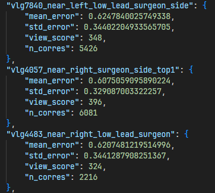
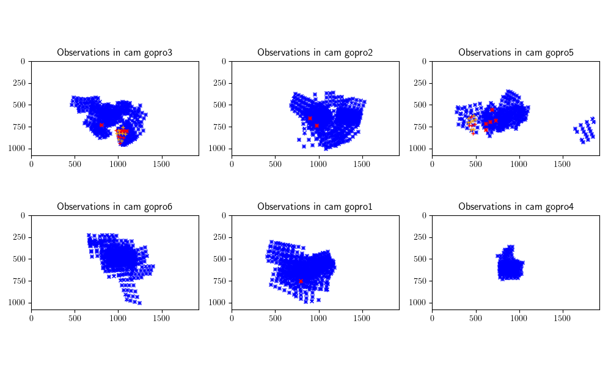
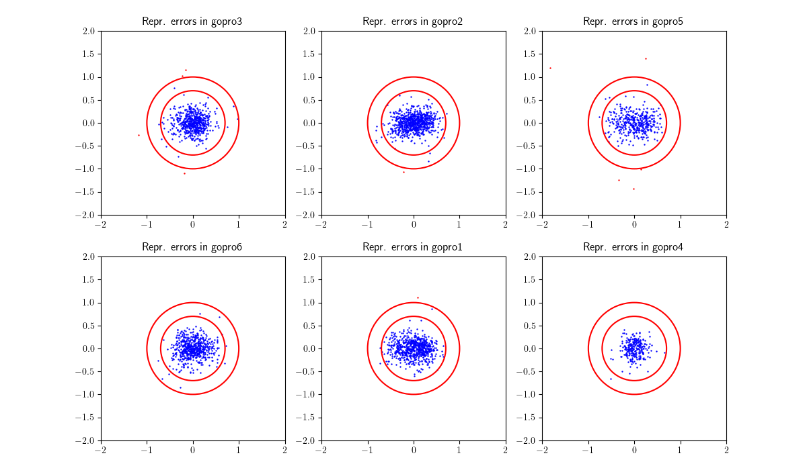

# **calib-board**

A Python package for performing **external calibration** 📐 of multi-camera systems using synchronized images of a moving calibration pattern (e.g., chessboard or ChArUco) from **internally calibrated** 🔬 cameras.


## 📦 Contents

- 🏗️ [Installation]()
- 📖 [How to Use]()
    - 📚 [Preparation]()
    - ⚡ [Running the Calibration]()
    - 📊 [Output]()
    - 🚧 [Troubleshooting]()
- 🎫 [License]()
- 🤝 [Acknowledgments]()


## 🏗️ Installation
Note: it is recommended to install this package through the external calibration meta-repository 👉`calibrate` to automatically get all the necessary dependencies! However, if this repository is installed standalone, the following steps are necessary:

1. Install dependecies:
    This package depends on the custom utilities Python package 👉`calib-commons`. Information on how to install it can be found in it's readme.

2. Clone the repo
    ```bash
    git clone https://github.com/BAL-ROCS-BUT-COOL/calib-board.git
    cd calib-board
    ```
3. Install the package and its requirements using `pip`:
    ```bash
    pip install -e .
    ```
    - Note: using the `-e` flag installs this package in editable mode (recommended). This means that changes made locally to the files are immediately reflected when importing the modules in other scripts.

4. Install additional dependencies (recommended):
    When using input videos for the board-calibration, `ffmpeg` is required. If not installed system wide anyways, the easiest way is to set up a conda environment for this package:
    ```bash
    conda create --name calibration python=3.11 ffmpeg
    conda activate calibration
    ```
    or alternatively, install `ffmpeg` in and existing conda environment
    ```bash
    conda install ffmpeg
    ```

## 📖 How to Use

This package contains all the functionality to perform external calibration with either a checkerboard or a charuco board. The workflow for both patterns is nearly identical - the only difference is that the parameters for running the main calibration script have to be set differently.

### 📚 Preparation

To run the calibration, two inputs are needed (details and recommendations regarding each input can be found in the subsequent sections):
- Parameters of the **internal calibration** for each individual camera (obtained using 👉`calib-commons`)
- **Synchronized videos or frame-series** from all cameras that include at least parts where the ckeckerboard is visible by multiple cameras at the same time (obtained using 👉`RocSync`).

> Note: The camera names have to match exactly between the intrinsics files and the videos / image-folders. Sometimes renaming is necessary, depending on how the input files are presented

**Camera Intrinsics (Internal Calibration Parameters)**

A folder containing all the internal calibration files can be specified via the `--intrinsics-path` parameter. The directory is expected to contain one json file for each camera-name (containing the intrinsics and distortion parameters) and has the following structure: 
```plaintext
intrinsics_directory/
├── <camera_name_1>_intrinsics.json
├── <camera_name_2>_intrinsics.json
└── ...
```

**Synchronized Videos / Frame-Series**

The synchronized footage serves as the main intput to the calibration. This can either be in the form of precisely synchronized videos (one video per camera) or synchronized frame-series (one folder of frames per camera). It is recommended to directly supply frame-series (the calibration will anyways need to extract frames from the videos, so this skips an unnecessary step). The following structure is expected for the input directory specified via the `--input-folder` parameter:

when using frame-series:
```plaintext
input_folder/
├── <camera_name_1>/
│   ├── 1.jpg
│   ├── 2.jpg
│   └── ...
└── <camera_name_2>/
    ├── 1.jpg
    ├── 2.jpg
    └── ...
```

when using videos:
```plaintext
input_folder/
├── <camera_name_1>.mp4
└── <camera_name_1>.mp4
```
> Note: to avoid hard-to-detect errors later on, it is advised to quickly check the synchronized input for each camera. First of all, slight imprecision in the temporal synchronization can be detrimental and lead to a lot of outliers and weird results. Additionally, if any camera has moved even just slightly during the calibration sequence, it should be removed entirely, since its observations will be ambiguous and can "poison" the pose estimates of all other cameras. Finally it can be beneficial to remove cameras where visibility of the calibration board is very unstable/poor or all detections of the calibration board only cover a very small part of the field of view.


### ⚡ Running the Calibration

Once all the inputs have been prepared accordingly, the external calibration is performed by using the file `scripts\run.py`. A minimal example of the command used to start the calibration might be: 

```bash
python scripts/run.py --input-folder <path_to_images_or_videos> --intrinsics-folder <path_to_intrinsics_folder> --out-folder-calib <path_to_output_folder>
```
For more fine-grained control over the process, the follwing parameters are available, with a short explanation of what the purpose of each is:

**Help**
- `-h`: 

**Required**
- `--input-folder`: 
- `--intrinsics-path`: 

**Input/Output Params**
- `--out-folder-calib`: 
- `--sampling-step`: 
- `--start-time-window`: 
- `--end-time-window`: 
- `--force-rerun / --no-force-rerun`: 

**Pre-Processing Params**
- `--board-type`: 
- `--charuco-marker-size`: 
- `--charuco-dictionary`: 
- `--show-detection-images / --no-show-detection-images`: 
- `--save-detection-images / --no-save-detection-images`: 
- `--show-viz / --no-show-viz`: 
- `--save-viz / --no-save-viz`: 
- `--save-eval-metrics-to-json / --no-save-eval-metrics-to-json`: 
- `--save-colmap-reconstruction / --no-save-colmap-reconstruction`: 

**Calibration Pattern Params**
- `--checkerboard-geometry.rows` : 
- `--checkerboard-geometry.columns` : 
- `--checkerboard-geometry.square-size`:  

**Calibration Params**
- `--external-calibrator-config.checkerboard-motion`: 
- `--external-calibrator-config.min-track-length`: 
- `--external-calibrator-config.reprojection-error-threshold`: 
- `--external-calibrator-config.min-number-of-valid-observed-points-per-checkerboard-view`: 
- `--external-calibrator-config.camera-score-threshold`: 
- `--external-calibrator-config.ba-least-square-ftol`: 
- `--external-calibrator-config.least-squares-verbose`: 
- `--external-calibrator-config.free-first, --external-calibrator-config.no-free-first`: 
- `--external-calibrator-config.verbose`: 

> Note: when using `-h` there is one more class of parameters shown (`external-calibrator-config.checkerboard-geometry options`). However, these are automatically copied from the `calibration pattern params` anyways, so they do not have to be set specifically.


### 📊 Output
The main outputs generated by this package are the camera poses which are stored in the folder specified by `--out-folder-calib` in the form of a json file. Since the external calibration via calibration boards (of known size) is only defined up to a rigid body transformation, one camera is chosen as the origin and all the other poses are expressed relative to this origin.  

Additionally the following metrics are automatically generated and also stored in the output folder:

- `metrics.json`: In this file the most important metrics of the calibration for each individual camera can be found. `mean_eror` is the mean reprojection errors of all the observations of one camera. `mean_view_score` is a heuristic that quantifies how well distributed the observation points are in the camera's field of view (better distribution leads to more stable calibration, for more details see the [COLMAP Paper](https://demuc.de/papers/schoenberger2016sfm.pdf)). Lastly, `n_corres` is the number of correspondences (shared detections) each camera has. 
- `detections_2d.png`: This is a visualization of the reprojection of all the 3D calibration points (into the respectiv camera image plane). The colors encode whether a point was used for calibration (blue) or whether it was filtered due to being an outlier (red). These plots can be a good way for gauging how well distributed the detections are in the camera's field of view. 
- `reprojection_errors_2d.png`: These are the detailed reprojection errors (for each point and camera) in an x-y scatterplot.

> Note: A camera’s correspondences are the valid observations it makes of 3D points that are seen by at least one other camera. The collection of cameras that observe a given 3D point validly is called that point’s track. The number of such cameras is called "track length".

<table width="100%">
  <thead>
    <tr>
      <th width="33.33%"><code>metrics.json</code></th>
      <th width="33.33%"><code>detections_2d.png</code></th>
      <th width="33.33%"><code>reprojection_errors_2d.png</code></th>
    </tr>
  </thead>
  <tbody>
    <tr>
      <td width="33.33%"></td>
      <td width="33.33%"></td>
      <td width="33.33%"></td>
    </tr>
  </tbody>
</table>


### 🚧 Troubleshooting

TODO

## 🎫 License

This project is licensed under the **MIT License**. See the [LICENSE](./LICENSE) file for details.

## 🤝 Acknowledgements

TODO
